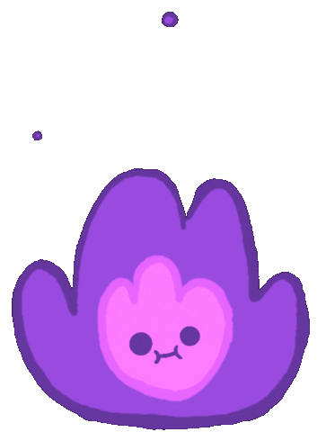

<h1 align="center">RPAN PROJECTS</h1>

<p align="center">
    <a href="https://kuinginngopi.github.io">
        
    </a>
</p>

</p>
<p align="center">
<a href="https://kuinginngopi.github.io"></a>
</p>
<p align="center">
<a href="https://github.com/kuinginngopi/followers"></a>
<a href="https://github.com/kuinginngopi/Rpan/stargazers/"></a>
<a href="https://github.com/kuinginngopi/Rpan/network/members"></a>
<a href="https://github.com/kuinginngopi/Rpan/watchers"></a>
<a href="https://github.com/kuinginngopi/Rpan"></a>
<a href="https://github.com/kuinginngopi/Rpan/"></a>
<a href="https://hits.seeyoufarm.com"></a>
<a href="https://github.com/kuinginngopi/Rpan/graphs/commit-activity"></a>&nbsp;&nbsp;
</p>

<p align="center">
  <a href="https://github.com/kuinginngopi/Rpan#instalasi">Installation</a> •
  <a href="https://github.com/kuinginngopi/Rpan#thanks-to">Thanks to</a> •
  <a href="https://github.com/kuinginngopi/Rpan#donate">Donate</a></br>
  <a href="https://github.com/kuinginngopi/Rpan#Official-Group"> Official Group Bot</a> •
  <a href="https://github.com/kuinginngopi/Rpan#settings">Settings</a>

</p>
</div>


# Instalasi
## Heroku Buildpack

Click the deploy icon below !

[](https://heroku.com/deploy?template=https://github.com/kuinginngopi/Rpan)

```bash
 > heroku/nodejs
 > https://github.com/jonathanong/heroku-buildpack-ffmpeg-latest
 > https://github.com/clhuang/heroku-buildpack-webp-binaries.git
```

## Termux
```bash
> apt update && apt upgrade
> pkg install libweb nodejs git ffmpeg
> git clone https://github.com/kuinginngopi/Rpan.git
> cd Rpan
> npm install
> node Rpan.js
```

## settings
You can edit owner and other in `'./settings/config.json'`

```ts
{
	"ownername":"kuinginngopi",
	"ownernumber":"6281920239749",
	"botname":"Rpan-Bot⚡",
	"thumbnail":"./settings/logo.jpg",
	"session_name":"./session.json"
}
```


# Thanks To
- My god
- Penyedia module
- Teman" yang selalu support saya
- Kalian semua 🛐
